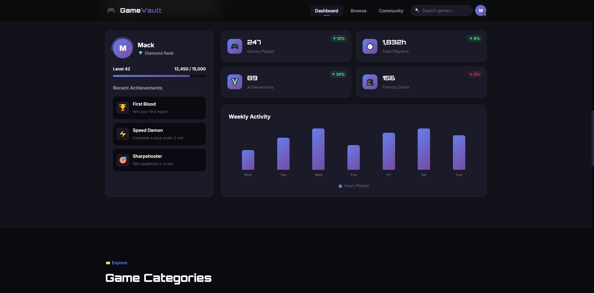
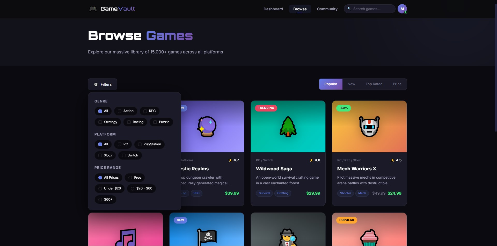
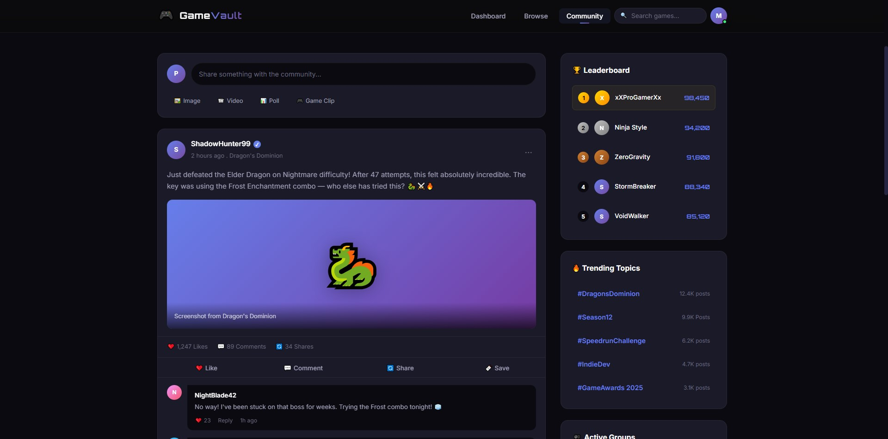

# 🎮 GameVault — Gaming Dashboard & Discovery Platform

A stunning, fully responsive gaming dashboard built with **pure HTML & CSS** — no JavaScript required.

> 🔗 **[Live Demo](https://mackisios.github.io/GameVault/)*


## ✨ Features

- **3 Full Pages** — Dashboard, Browse, Community
- **Pure CSS Interactions** — Mobile menu, filters, animations (no JS)
- **Fully Responsive** — Mobile-first, works on all devices
- **CSS Animations** — Smooth transitions, loading screen, floating elements
- **Accessibility** — Semantic HTML, focus states, reduced-motion support
- **Custom Scrollbar** — Themed to match the dark UI
- **CSS-Only Components:**
  - Animated loading screen
  - Hamburger menu toggle
  - Filter dropdown
  - Sort tabs
  - Progress bars & charts
  - Poll voting & interface
  - Card hover effects

## 🛠️ Tech Stack

| Technology | Purpose |
|------------|---------|
| HTML5 | Semantic structure |
| CSS3 | Styling, animations, layout |
| CSS Grid | Page layouts |
| CSS Flexbox | Component layouts |
| CSS Custom Properties | Theming system |
| Google Fonts | Typography (Inter + Orbitron) |

## 📁 Project Structure
- GameVault/
- ├── index.html # Main dashboard page
- ├── browse.html # Game browsing with filters
- ├── community.html # Social feed with sidebar
- ├── css/
- │ └── styles.css # Complete stylesheet (~2000 lines)
- └── README.md # This file

## 🚀 Getting Started

1.  Clone the repository:
    ```bash
    git clone https://github.com/mackisios/gamevault.git
2.  Open index.html in your browser
3.  No build tools, no dependecies - it just works!

## 📱 Responsive Breakpoints

- Desktop: 1024px+
- Tablet: 768px - 1024px
- Mobile: 480px - 768px
- Small Mobile: < 480px

## 🎨 Design Highlights

- Dark theme with purple/blue accent gradients
- Glassmorphism navigation bar
- Card-based UI with hover animations
- Emoji-based icons (no external icon library needed)
- CSS-only bar chart visualization
- Animated progress bars and level systems

##  Skills Demonstrated

- Advanced CSS Grid & Flexbox layouts
- CSS Custom Properties (theming)
- CSS animations & transitions
- Responsive design patterns
- BEM-imspired naming conventions
- Accessbility best practices
- Complex component design without JavaScript
- Perfomance optimaztion (no JS = faster load)

## 📸 Screenshots

### Dashboard (Home Page)


### Browse Games


### Community Feed


## Key Highlights

| Skill Demonstrated | Where It Shows |
|--------------------|----------------|
| **CSS Grid mastery** | Dashboard stats layout, game card grids, footer, community layout |
| **CSS Flexbox** | Navbar, card internals, timelines, filter bars |
| **CSS Custom Properties** | Full theming system with 30+ vartiables |
| **CSS-only interactivity** | Hamburger menu, filter dropdowns, sort tabs - all using checkbox/radio hacks |
| **Responsive design** | 4 breakpoints, mobile nav, collapsing grids |
| **Animations** | Loading screen, floating shapes, card hovers, progress bars, chart bars |
| **Accessibility** | 'prefers-reduced-motion', focus-visible, semantic HTML |
| **Multi-page architecture** | 3 interconnected pages with consistent navigation |
| **Complex layouts** | Community page with sidebar, dashboard with mixed grid areas |

## 🔮 Future Improvements

- Add JavaScript for real interactivity
- Dark/Light theme toggle
- Connect to a real game API (IGDB, RAWG)
- Add user authentication
- Convert to Reach component library
- Add game detail pages
- Implement real search functionality

## 📄 License

- MIT License - feel free to use this in your portofolio!

## 👤 Author

- Anastasis (Mack) Makridis
- GitHub: mackisios
- LinkedIn: mackisios

## ⭐ If you found this useful, consider giving it a star!
